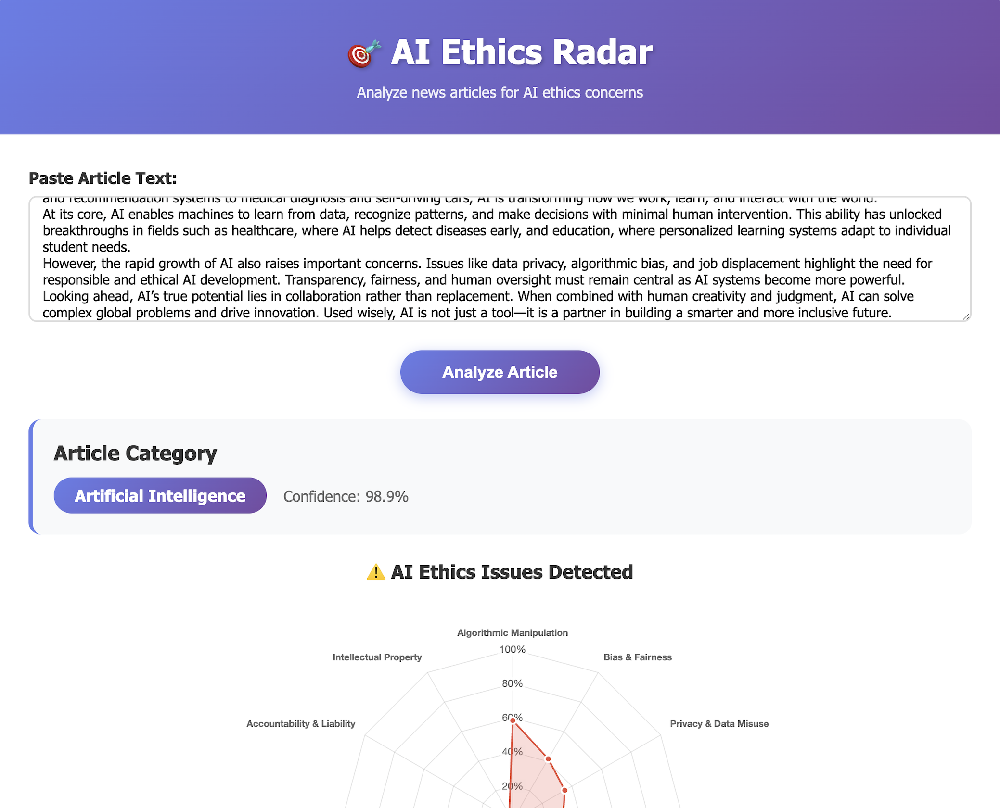
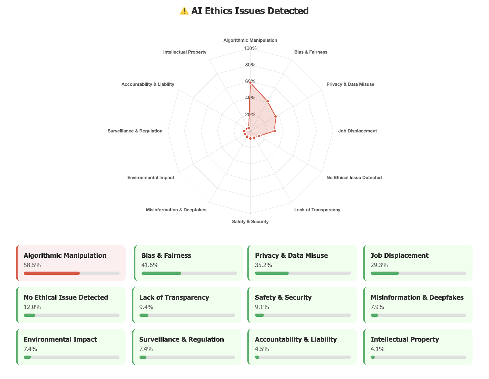
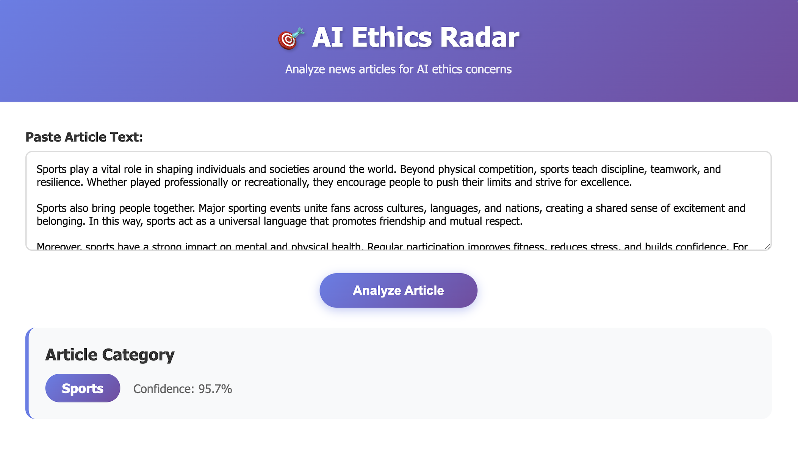

# 🎯 AI Ethics Radar

> A two-stage multi-label text classification system that automatically identifies AI-related news articles and detects ethical concerns using deep learning.

[](https://www.python.org/downloads/)
[](https://opensource.org/licenses/MIT)
[](https://flask.palletsprojects.com/)
[](https://deepwiki.com/SouravNeatC/AI_Ethics_Radar)

---

## 📋 Table of Contents

- [Overview](#overview)
- [Problem Statement](#problem-statement)
- [System Architecture](#system-architecture)
- [Dataset](#dataset)
- [Models & Performance](#models--performance)
- [Installation](#installation)
- [Usage](#usage)
- [Project Structure](#project-structure)
- [Results & Analysis](#results--analysis)
- [Deployment](#deployment)
- [Future Work](#future-work)
- [Contributors](#contributors)
- [License](#license)

---

## 🎯 Overview

<table style="width: 100%;">
  <tr>
    <td style="width: 50%; text-align: center;">
      
    </td>
    <td style="width: 50%; text-align: center;">
      
    </td>
  </tr>
</table>

<p align="center">
  
</p>

**AI Ethics Radar** is an end-to-end NLP system that analyzes news articles to:
1. **Classify main categories** (AI, Technology, Business, Politics, Sports, Others)
2. **Detect AI ethics issues** across 12 dimensions when AI content is identified

The system uses a **two-stage classification pipeline**:
- **Stage 1**: Multi-label classification across 6 main categories
- **Stage 2**: Multi-label detection of 12 AI ethics issues (only for AI-related articles)

---

## 🔍 Problem Statement

As artificial intelligence becomes increasingly prevalent in news media, there's a growing need to:
- Automatically identify AI-related content
- Detect potential ethical concerns in AI applications
- Provide structured insights into AI ethics dimensions

This project addresses these needs by building an automated system that can process news articles and flag ethical considerations across multiple dimensions.

---

## 🏗️ System Architecture

```
┌─────────────────┐
│  Input Article  │
└────────┬────────┘
         │
         ▼
┌─────────────────────────┐
│  Stage 1: Category      │
│  Classification         │
│  (TF-IDF + LogReg)      │
│  6 Categories           │
└────────┬────────────────┘
         │
         ▼
    Is AI Related?
         │
    ┌────┴────┐
    │   NO    │──► Return Category Only
    └─────────┘
         │
        YES
         │
         ▼
┌─────────────────────────┐
│  Stage 2: Ethics        │
│  Detection              │
│  (RoBERTa + ONNX)       │
│  12 Ethics Labels       │
└────────┬────────────────┘
         │
         ▼
┌─────────────────────────┐
│  Output: Category +     │
│  Ethics Radar Chart     │
└─────────────────────────┘
```

---

## 📊 Dataset

### Data Collection
- **Source**: Web scraping using Selenium from major tech news outlets
  - MIT Technology Review
  - Wired
  - The Verge
  - TechCrunch
  - Ars Technica
- **Total Articles**: 26,076
- **AI Articles**: 20,502 (78.6%)
- **Scraping Period**: November 2025

### Labeling Strategy
- **Stage 1**: Zero-shot classification using BART-large-MNLI
- **Stage 2**: Zero-shot multi-label classification for AI ethics
- **Threshold**: 0.6 for converting probabilities to binary labels

### Ethics Dimensions (12 Labels)
1. **Bias & Fairness** - Algorithmic discrimination and fairness concerns
2. **Privacy & Data Misuse** - Personal data handling and privacy violations
3. **Job Displacement** - Employment and workforce impacts
4. **Misinformation & Deepfakes** - False information and synthetic media
5. **Accountability & Liability** - Responsibility and legal concerns
6. **Environmental Impact** - Energy consumption and carbon footprint
7. **Surveillance & Regulation** - Monitoring and government oversight
8. **Safety & Security** - Physical and cybersecurity risks
9. **Intellectual Property** - Copyright and ownership issues
10. **Lack of Transparency** - Opacity in AI decision-making
11. **Algorithmic Manipulation** - Behavioral influence and manipulation
12. **No Ethical Issue Detected** - Control label

---

## 🤖 Models & Performance

### Stage 1: Main Category Classification

| Model | Test Micro F1 | Test Macro F1 | Hamming Loss | Training Time |
|-------|--------------|---------------|--------------|---------------|
| **TF-IDF + LogReg** ⭐ | **0.8168** | **0.7006** | **0.1759** | **0.88 min** |
| DistilBERT | 0.8033 | 0.6854 | 0.1791 | 32.77 min |
| RoBERTa | 0.8162 | 0.6828 | 0.1766 | 230.27 min |

**Winner**: TF-IDF + Logistic Regression (Best balance of speed and accuracy)

### Stage 2: AI Ethics Detection

| Model | Test Micro F1 | Test Macro F1 | Hamming Loss | Training Time |
|-------|--------------|---------------|--------------|---------------|
| TF-IDF + LogReg | 0.7857 | 0.7511 | 0.1855 | 0.73 min |
| DistilBERT | 0.7921 | 0.7325 | 0.1790 | 26.64 min |
| **RoBERTa** ⭐ | **0.7983** | **0.7416** | **0.1719** | **52.78 min** |

**Winner**: RoBERTa (Best overall performance for multi-label ethics detection)

### Model Optimization
- **ONNX Conversion**: RoBERTa model converted to ONNX format
- **Quantization**: INT8 quantization reduced model size by 74.8%
  - Original: 475.83 MB → Quantized: 119.75 MB
- **Inference Speed**: ~2.04 seconds per article on CPU

---

## 🚀 Installation

### Prerequisites
- Python 3.11+
- pip
- CUDA-capable GPU (optional, for faster inference)

### Setup

```bash
# Clone the repository
git clone https://github.com/yourusername/ai-ethics-radar.git
cd ai-ethics-radar

# Create virtual environment
python -m venv venv
source venv/bin/activate  # On Windows: venv\Scripts\activate

# Install dependencies
pip install -r requirements.txt

# Download models (from releases or trained yourself)
# Place in onnx_models/ directory
```

---

## 💻 Usage

### Flask Web Application

```bash
# Run the Flask app
python app.py

# Open browser and navigate to
http://localhost:5000
```

### Python API

```python
from app import predict_main_category, predict_ethics

# Analyze an article
article_text = "Your article text here..."

# Stage 1: Get category
category, confidence = predict_main_category(article_text)
print(f"Category: {category} (confidence: {confidence:.2%})")

# Stage 2: Get ethics predictions (if AI-related)
if category == "Artificial Intelligence":
    ethics_results = predict_ethics(article_text)
    for label, prob in ethics_results.items():
        if prob >= 0.5:
            print(f"  ⚠️ {label}: {prob:.2%}")
```

### Example Output

```
Category: Artificial Intelligence (confidence: 92.3%)

AI Ethics Issues Detected:
  ⚠️ Bias & Fairness: 78.5%
  ⚠️ Privacy & Data Misuse: 65.2%
  ⚠️ Lack of Transparency: 82.1%
  ⚠️ Accountability & Liability: 71.3%
```

---

## 📁 Project Structure

```
ai-ethics-radar/
├── app.py                          # Flask application
├── requirements.txt                # Python dependencies
├── README.md                       # This file
│
├── data/                           # Datasets
│   ├── articles_classified.jsonl  # Labeled articles
│   ├── train_stage1.csv           # Training data (Stage 1)
│   ├── train_stage2.csv           # Training data (Stage 2)
│   └── ...
│
├── src/                            # Source code
│   ├── scraper.py                 # Selenium web scraper
│   ├── preprocessing.py           # Data preprocessing
│   └── dataset_analysis.py        # EDA scripts
│
├── notebooks/                      # Jupyter notebooks
│   ├── 01_data_collection.ipynb
│   ├── 02_labeling.ipynb
│   ├── 03_training_stage1.ipynb
│   ├── 04_training_stage2.ipynb
│   └── 05_onnx_conversion.ipynb
│
├── models_stage1/                  # Stage 1 trained models
│   ├── distilbert-base-uncased/
│   └── roberta-base/
│
├── models_stage2/                  # Stage 2 trained models
│   ├── distilbert-base-uncased/
│   └── roberta-base/
│
├── onnx_models/                    # Optimized ONNX models
│   ├── stage1_tfidf/
│   │   ├── model.pkl
│   │   ├── vectorizer.pkl
│   │   └── labels.json
│   ├── stage2_best_model_quantized.onnx
│   └── stage2_best_model_tokenizer/
│
├── templates/                      # HTML templates
│   └── index.html                 # Main web interface
│
└── results/                        # Training results & visualizations
    ├── stage1_model_comparison.png
    ├── stage2_model_comparison.png
    └── *.json                     # Results metadata
```

---

## 📈 Results & Analysis

### Stage 1: Category Distribution


- **Most Common**: Artificial Intelligence (78.6%), Technology (85.9%)
- **Least Common**: Sports (17.6%), Politics (21.7%)
- **Challenge**: Severe class imbalance addressed with `class_weight='balanced'`

### Stage 2: Ethics Issues Distribution


**Top 5 Most Detected Issues:**
1. Lack of Transparency (56.4%)
2. Accountability & Liability (55.9%)
3. Algorithmic Manipulation (51.1%)
4. Privacy & Data Misuse (47.0%)
5. Bias & Fairness (44.2%)

**Key Insights:**
- 80.8% of AI articles have at least one ethical concern
- Average of 5.2 ethics labels per AI article
- Only 19.2% flagged as "No Ethical Issue Detected"

### Model Comparison


**Key Findings:**
- TF-IDF surprisingly competitive despite simplicity
- RoBERTa best for nuanced multi-label classification
- ONNX quantization maintains 98%+ accuracy with 4x smaller size

---

## 🌐 Deployment

### Local Development
```bash
python app.py
# Access at http://localhost:5000
```

### Render Deployment
```bash
# Create Dockerfile
FROM python:3.11-slim
WORKDIR /app
COPY requirements.txt .
RUN pip install -r requirements.txt
COPY . .
CMD ["gunicorn", "-b", "0.0.0.0:5000", "app:app"]

# Push to GitHub and connect to Render
# Render will automatically build and deploy
```

### Hugging Face Spaces (Coming Soon)
- Gradio-based demo interface
- Simplified deployment without server management

---

## 🔮 Future Work

### Short-term Improvements
- [ ] Add per-class F1 scores and confusion matrices
- [ ] Implement batch processing for multiple articles
- [ ] Add confidence calibration for probability outputs
- [ ] Create API documentation with Swagger/OpenAPI

### Long-term Enhancements
- [ ] Real-time scraping and continuous learning pipeline
- [ ] Expand to 20+ ethics dimensions
- [ ] Multi-language support (Spanish, French, German, etc.)
- [ ] Fine-grained entity extraction (companies, people, technologies)
- [ ] Temporal analysis of ethics trends over time
- [ ] Integration with news APIs for automated monitoring

### Research Extensions
- [ ] Explainability: LIME/SHAP analysis for predictions
- [ ] Active learning for efficient labeling
- [ ] Cross-domain transfer learning (social media, research papers)
- [ ] Benchmark against human expert annotations

---

## 👥 Contributors

**Sourav Das**
- NLP Project
- December 2024

### Acknowledgments
- HuggingFace for transformer models
- Tech news outlets for article sources

---

## 📄 License

This project is licensed under the MIT License - see the [LICENSE](LICENSE) file for details.

---

## 📚 Citation

If you use this project in your research or work, please cite:

```bibtex
@software{ai_ethics_radar_2024,
  author = {Das, Sourav},
  title = {AI Ethics Radar: Automated Detection of Ethical Issues in AI News},
  year = {2024},
  url = {https://github.com/yourusername/ai-ethics-radar}
}
```

---


### Development Setup
```bash
# Fork the repo and clone your fork
git clone https://github.com/yourusername/ai-ethics-radar.git

# Create a feature branch
git checkout -b feature/amazing-feature

# Make your changes and commit
git commit -m 'Add amazing feature'

# Push and create a pull request
git push origin feature/amazing-feature
```

---
